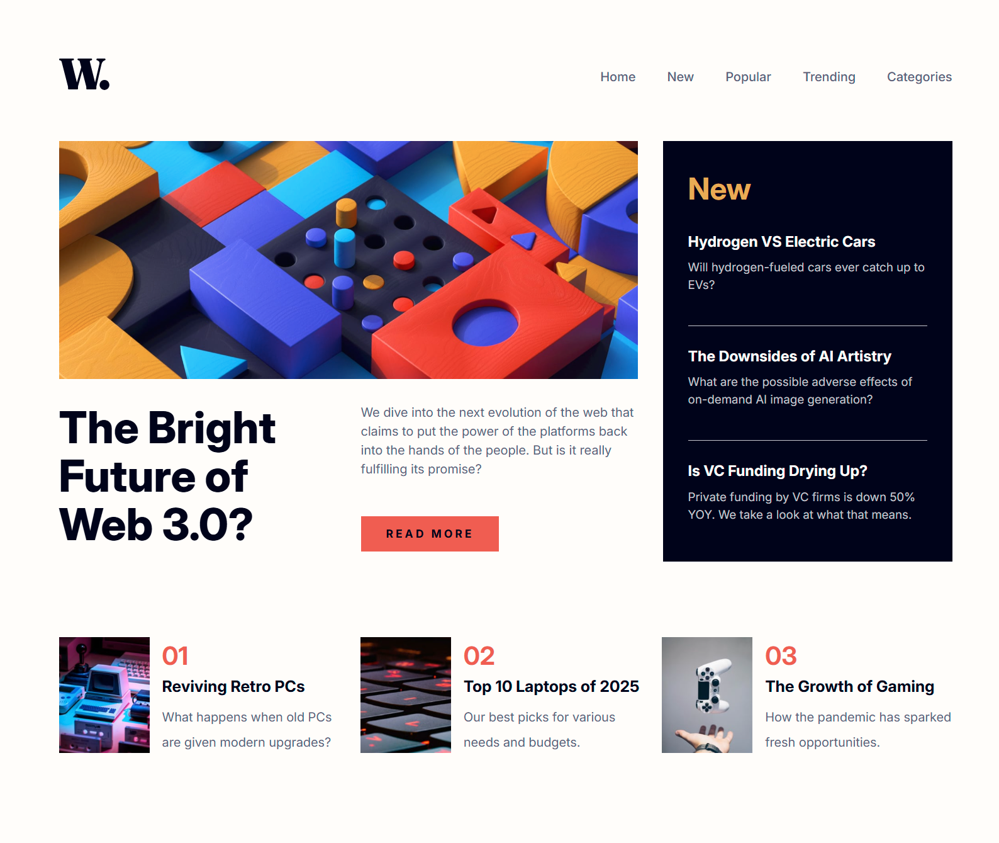

# Frontend Mentor - News homepage

This is a solution to the news homepage challenge on Frontend Mentor.

## Table of contents

- [Overview](#overview)
  - [The challenge](#the-challenge)
  - [Screenshot](#screenshot)
  - [Links](#links)
- [My process](#my-process)
  - [Built with](#built-with)
  - [What I learned](#what-i-learned)
  
## Overview

### The challenge

- Create a responsive news homepage that works well on all screen sizes.
- Implement a working mobile navigation menu with a hamburger toggle.
- Build a clean, accessible user interface following the provided design.

### Screenshot

### Links

- Live Site URL: [Live Site](https://master-code234.github.io/news-homepage/)

## My process

- Built with a mobile-first workflow to ensure responsiveness from the start.
- Semantic HTML5 markup for clean, accessible structure.
- Used BEM methodology for consistent, maintainable class naming.
- Flexbox and CSS Grid for layout and responsive design.
- Used JavaScript to implement the mobile navigation menu toggle.

### Built with

- Semantic HTML5 markup
- CSS Flexbox
- CSS Grid
- CSS variables
- Mobile-first workflow
- JavaScript
- BEM methodology

### What I learned

- Learned how to implement a hamburger menu for mobile devices.
- Strengthened my use of CSS Grid and Flexbox for responsive layouts.
- Learned how to use the **picture** and **source** elements to serve different images depending on screen size.